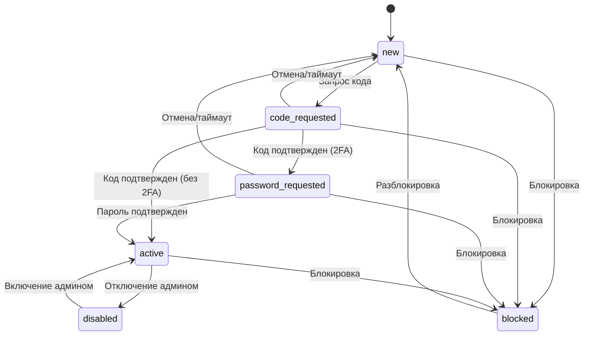

# Документация по состояниям аккаунта

## Диаграмма состояний

## Описание состояний

### Основные состояния
- `new` - Начальное состояние, аккаунт только добавлен в систему
- `code_requested` - Запрошен код аутентификации у Telegram
- `password_requested` - Требуется пароль 2FA (после успешной проверки кода)
- `active` - Аккаунт полностью аутентифицирован и готов к использованию
- `disabled` - Аккаунт временно отключен администратором
- `blocked` - Аккаунт заблокирован Telegram

## Переходы состояний

### Процесс авторизации
1. `new` → `code_requested`
   - Триггер: Начало процесса аутентификации
   - Условия: Аккаунт должен быть в состоянии `new`
   - Возможные ошибки: Проблемы с сетью, неверный номер телефона

2. `code_requested` → `password_requested`
   - Триггер: Успешная проверка кода при включенной 2FA
   - Условия: Предоставлен верный код аутентификации
   - Возможные ошибки: Неверный код, слишком много попыток

3. `code_requested` → `active`
   - Триггер: Успешная проверка кода при отключенной 2FA
   - Условия: Предоставлен верный код аутентификации
   - Возможные ошибки: Неверный код, слишком много попыток

4. `password_requested` → `active`
   - Триггер: Успешная проверка пароля 2FA
   - Условия: Предоставлен верный пароль 2FA
   - Возможные ошибки: Неверный пароль, слишком много попыток

### Восстановление после ошибок
1. `code_requested` → `new`
   - Триггер: Таймаут аутентификации или отмена
   - Условия: Нет
   - Примечания: Позволяет перезапустить процесс аутентификации

2. `password_requested` → `new`
   - Триггер: Таймаут аутентификации или отмена
   - Условия: Нет
   - Примечания: Позволяет перезапустить процесс аутентификации

### Административное управление
1. `active` → `disabled`
   - Триггер: Действие администратора
   - Условия: Аккаунт должен быть активен
   - Примечания: Временная приостановка работы аккаунта

2. `disabled` → `active`
   - Триггер: Действие администратора
   - Условия: Аккаунт должен быть отключен
   - Примечания: Повторное включение приостановленного аккаунта

### Блокировка
1. Любое состояние → `blocked`
   - Триггер: Обнаружение блокировки Telegram
   - Условия: Может произойти в любом состоянии авторизации
   - Примечания: Терминальное состояние, требующее ручного вмешательства

2. `blocked` → `new`
   - Триггер: Попытка ручной разблокировки
   - Условия: Аккаунт должен быть заблокирован
   - Примечания: Требуется полная повторная аутентификация

## Правила переходов состояний

1. Однонаправленные переходы:
   - Большинство переходов однонаправленные (например, `new` → `code_requested`)
   - Исключение: `active` ↔ `disabled` может быть обратимым

2. Поведение при блокировке:
   - Состояние `blocked` может быть достигнуто из любого состояния аутентификации
   - Восстановление из `blocked` всегда проходит через состояние `new`

3. Последовательность аутентификации:
   - Должна следовать порядку: `new` → `code_requested` → (`password_requested`) → `active`
   - Нельзя пропускать состояния в последовательности аутентификации

4. Административные состояния:
   - Только активные аккаунты могут быть отключены
   - Только отключенные аккаунты могут быть повторно активированы

## Технические детали реализации

1. Контроль на уровне базы данных:
   - Все переходы контролируются триггером базы данных
   - Недопустимые переходы вызывают исключения
   - Триггер предотвращает гонки состояний при изменениях

2. Контроль флуда:
   - Флуд-контроль обрабатывается отдельно от состояний
   - Реализован как поле временной метки `flood_wait_until`
   - Может возникнуть при любой операции с Telegram

3. Обработка ошибок:
   - Ошибки аутентификации не меняют состояние
   - Сетевые ошибки не меняют состояние
   - Сохраняются только подтвержденные изменения состояния
