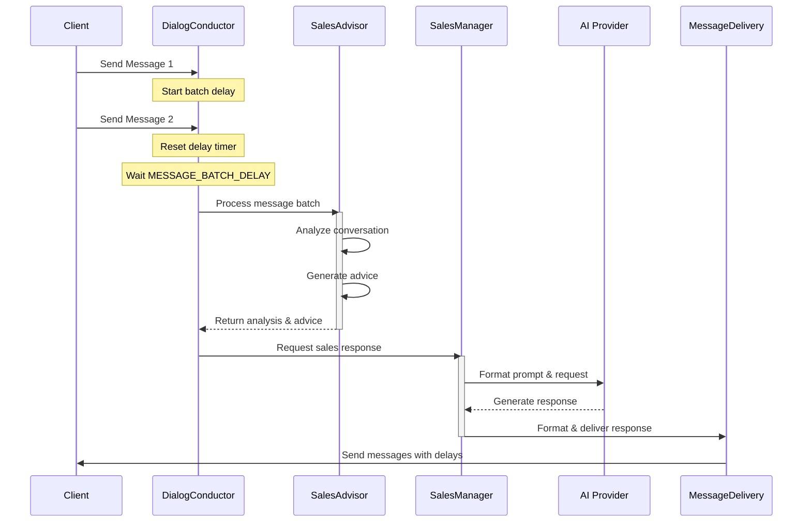

# Message Flow in Sales Dialog System

## Overview

The Sales Dialog System implements a sophisticated message handling mechanism that supports natural conversation flow between clients and the AI sales manager. The system handles message aggregation, multi-part responses, and timed delivery to create a more human-like interaction.

## Key Components

### DialogConductor

Located in `core/messaging/conductor.py`, this component:
- Orchestrates the entire sales dialog flow
- Manages message batching and delivery
- Integrates with SalesAdvisor and SalesManager
- Handles asynchronous message processing

### SalesAdvisor

Located in `core/ai/sales/advisor.py`:
- Provides conversation analysis
- Generates contextual sales advice
- Formats dialog history for AI processing
- Integrates with AI provider for response generation

### SalesManager

Located in `core/ai/sales/manager.py`:
- Generates sales responses based on conversation context
- Handles initial greetings and farewell messages
- Integrates with AI provider for response generation
- Uses formatted prompts for consistent sales communication
- Manages conversation stages and warmth levels

### MessageDelivery

Located in `core/messaging/delivery.py`:
- Handles message delivery with configurable delays
- Supports batched message processing
- Manages delivery status and error handling

## Message Flow Process

### Component Interaction Diagram



### 1. Client Message Handling

When a client sends messages:

```
Client              DialogConductor           SalesAdvisor            SalesManager
  |                      |                         |                      |
  | Message 1            |                         |                      |
  |--------------------->|                         |                      |
  |                      | Start batch delay       |                      |
  | Message 2            |                         |                      |
  |--------------------->|                         |                      |
  |                      | Reset batch delay       |                      |
  |                      | Wait MESSAGE_BATCH_DELAY|                      |
  |                      |                         |                      |
  |                      | Process batch           |                      |
  |                      |------------------------>|                      |
  |                      |                         | Analyze              |
  |                      |                         | Generate advice      |
  |                      |<------------------------|                      |
  |                      | Get sales response      |                      |
  |                      |----------------------------------------------->|
  |                      |                         |    Generate response |
  |                      |<-----------------------------------------------|
  |                      | Deliver messages        |                      |
```

### 2. Bot Response Generation

After processing client input:

```
SalesManager              AI Provider            MessageDelivery
     |                        |                       |
     | Format prompt          |                       |
     | with context & advice  |                       |
     |----------------------->|                       |
     |                        | Generate              |
     |                        | sales response        |
     |<-----------------------|                       |
     |                        |                       |
     | Format response        |                       |
     |----------------------------------------------->|
     |                        |                       | Send with
     |                        |                       | delays
```

### 3. Dialog History Management

Each interaction is tracked in the dialog history:
- Client messages are stored after batch processing
- Bot responses are stored as individual messages
- Full context is maintained for AI processing

## Configuration

### Timeouts and Delays

- Client message batch delay: 5 seconds
- Bot message delay between parts: 1 second
- These values can be adjusted in `MessageDelivery`

### Message Formatting

- Bot messages are split on double newlines (`\n\n`)
- Client messages are joined with space separator
- Format can be customized in `MessageDelivery`

## Example Flow

1. Client sends multiple messages quickly:
   ```
   Client: Hi
   Client: I'm interested in
   Client: your services
   ```

2. System aggregates to:
   ```
   "Hi I'm interested in your services"
   ```

3. Bot generates multi-part response:
   ```
   Hello! Welcome to our service.

   I'd be happy to tell you about what we offer.

   Could you share what specific aspects interest you?
   ```

4. System sends responses with delays:
   ```
   Bot: Hello! Welcome to our service.
   [1s delay]
   Bot: I'd be happy to tell you about what we offer.
   [1s delay]
   Bot: Could you share what specific aspects interest you?
   ```

## Error Handling

- Message batch delays are handled gracefully
- Failed message sends are logged
- Dialog state is maintained even if messages fail
- All errors are logged with full context

## Future Improvements

Potential enhancements to consider:
1. Dynamic batch delay adjustment based on client typing patterns
2. Smart message splitting based on content context
3. Adaptive delay timing based on message length
4. Enhanced error recovery for failed message delivery
