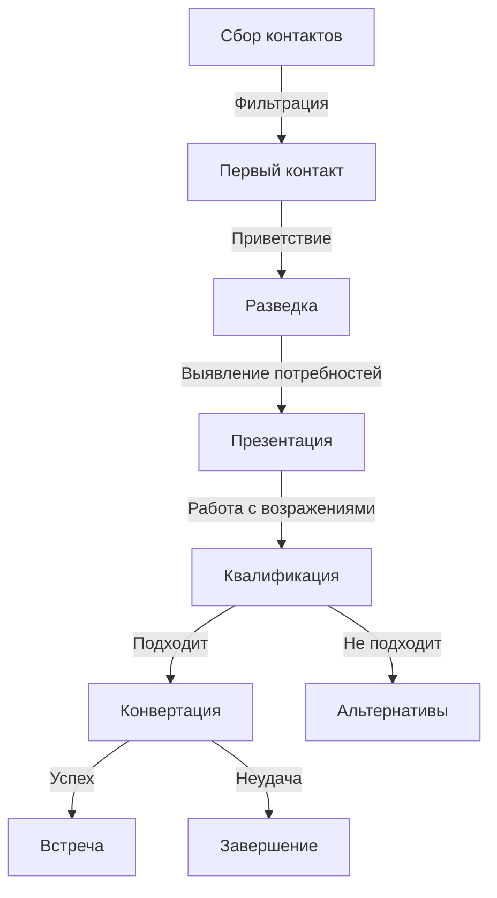

# Процесс продаж

## Общее описание
Процесс привлечения и конвертации клиентов в инвестиционные продукты через систему автоматизированных диалогов, от первичного контакта до успешной продажи.

## Воронка продаж

### Этапы процесса

#### 1. Сбор контактов
- Парсинг участников инвестиционных групп
- Парсинг комментаторов инвестиционных каналов
- Фильтрация и обогащение данных

#### 2. Первый контакт
- Короткое приветствие с представлением
- Проверка базового интереса
- Определение дальнейшего направления

#### 3. Разведка
- Выявление текущего опыта в инвестициях
- Понимание сферы интересов
- Определение уровня знаний
- Оценка заинтересованности

#### 4. Презентация
- Объяснение принципов работы
- Демонстрация преимуществ
- Проверка понимания
- Работа с возражениями

#### 5. Квалификация
- Выявление размера возможных инвестиций
- Определение временных рамок
- Проверка соответствия критериям
- Оценка серьезности намерений

#### 6. Конвертация
- Предложение звонка с руководителем
- Объяснение ценности разговора
- Согласование деталей встречи
- Предложение альтернатив при необходимости

#### 7. Завершение
- Успешное назначение встречи
- Сохранение контакта для будущего
- Корректное закрытие диалога

### Метрики процесса

#### Ключевые показатели
- Конверсия из контакта в диалог
- Конверсия из диалога в квалификацию
- Конверсия из квалификации во встречу
- Средний чек по сделке

#### Точки контроля
- Время ответа клиента
- Длительность диалога
- Причины отказов
- Эффективность скриптов

## Техники ведения диалога

### Короткие сообщения
- Представление только в начале диалога
- Не более 7 слов в сообщении
- Разбивка длинных мыслей
- Простые формулировки

### Техники вовлечения
- Открытые вопросы
- Искренний интерес
- Использование имени клиента
- Анализ и учет ответов

### Работа с возражениями
- Избегание споров
- Использование "Да, и..." вместо "Но"
- Уточняющие вопросы
- Предложение альтернатив

## Адаптация стиля

### Уровни теплоты
1. Холодный: Максимально краткие, нейтральные сообщения
2. Прохладный: Вежливые, ненавязчивые вопросы
3. Нейтральный: Умеренно активный, дружелюбный тон
4. Теплый: Энтузиазм, комплименты, развернутые ответы
5. Горячий: Активное ведение к следующим шагам

### Человекоподобное поведение

#### Стиль набора
- Редкие опечатки (20% сообщений)
- Неформальная пунктуация
- Разбивка на короткие сообщения

#### Разговорный стиль
- Простые сокращения ("спс", "норм")
- Разговорные формулировки
- Междометия ("хм", "ага")

#### Эмоциональность
- Базовые эмоджи (1-2 за диалог)
- Реакция на эмоции клиента
- Выражение понимания
