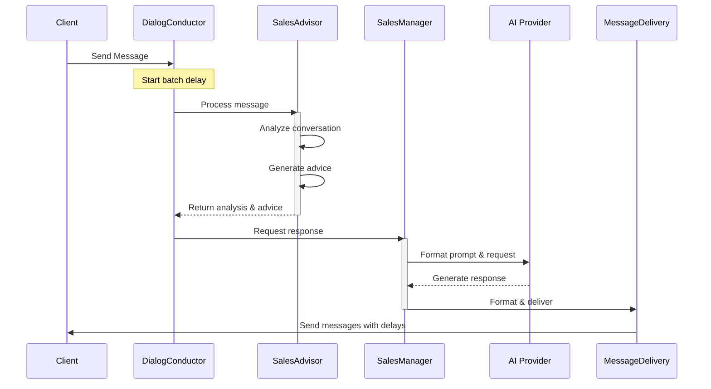
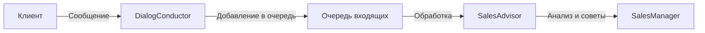
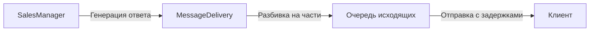

# Система обработки сообщений

## Общее описание
Система обработки сообщений отвечает за управление диалогами с клиентами, доставку сообщений и сохранение истории взаимодействий. Реализована с учетом асинхронности и масштабируемости.

## Архитектура системы

### Диаграмма взаимодействия компонентов

## Основные компоненты

### DialogConductor
- Управляет жизненным циклом диалога
- Координирует взаимодействие между клиентом и AI
- Отслеживает состояние диалога и его статус
- Обрабатывает очередь входящих сообщений
- Поддерживает отмену операций и обработку ошибок

### MessageDelivery
- Обеспечивает надежную доставку сообщений
- Управляет очередью исходящих сообщений
- Разбивает длинные сообщения на части
- Контролирует задержки между сообщениями
- Поддерживает отмену отправки

### Модели данных
- Dialog: хранит информацию о диалоге и его статусе
- Message: содержит текст сообщения и метаданные
- DialogStatus: перечисление возможных состояний диалога
- MessageDirection: направление сообщения (входящее/исходящее)

### Работа с БД
- DialogQueries: запросы для работы с диалогами
- MessageQueries: запросы для работы с сообщениями
- Поддержка транзакций и атомарных операций

## Процесс обработки сообщений

### 1. Получение сообщения

### 2. Отправка ответа

## Конфигурация

### Таймауты и задержки
- Задержка между сообщениями: 1-2 секунды
- Таймаут ожидания ответа: 5 минут
- Максимальное время диалога: 30 минут

### Форматирование сообщений
- Разделение по двойным переносам строк
- Максимальная длина части: 4096 символов
- Поддержка Markdown-разметки

## Обработка ошибок
- Повторные попытки отправки
- Сохранение состояния при сбоях
- Логирование всех операций
- Graceful degradation при перегрузках

## Взаимодействие с другими системами
- AI компоненты: получение ответов и анализ диалога
- Система аккаунтов: проверка прав и ограничений
- Telegram API: отправка и получение сообщений
