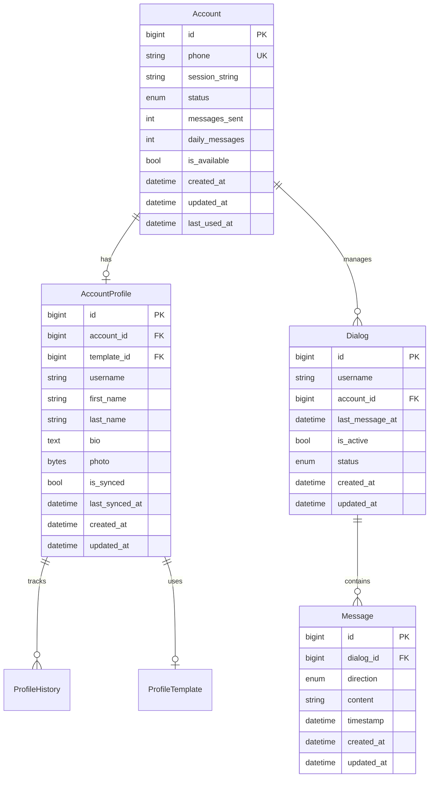

# База данных

## Архитектура

### Основные компоненты
- Аккаунты и профили (`jeeves/core/accounts/models/`)
  - `account.py` - модели аккаунтов и их состояний
  - `profile.py` - модели профилей и их истории
- Диалоги и сообщения (`jeeves/core/messaging/models/`)
  - `dialog.py` - модели диалогов и их статусы
  - `message.py` - модели сообщений и направления

### Общая схема


## Работа с базой данных

### Декоратор @with_queries

Декоратор для автоматического управления сессиями базы данных. Поддерживает работу с одним или несколькими классами запросов:

```python
# Один класс запросов
@with_queries(AccountQueries)
async def get_accounts(queries: AccountQueries):
    return await queries.get_all_accounts()

# Несколько классов запросов
@with_queries(DialogQueries, AccountQueries)
async def start_dialog(
    dialog_queries: DialogQueries,
    account_queries: AccountQueries
):
    account = await account_queries.get_available_account()
    return await dialog_queries.create_dialog(account.id)
```

#### Особенности работы
1. Автоматическое создание и закрытие сессии
2. Общая сессия для всех классов запросов
3. Автоматический rollback при ошибках
4. Именование параметров по типу запросов

#### Правила использования

✅ Правильно:
```python
@with_queries(AccountQueries)
async def check_account(queries: AccountQueries):
    account = await queries.get_account_by_phone(phone)
    return account.status == AccountStatus.active

@with_queries(DialogQueries, AccountQueries)
async def process_dialog(
    dialog_queries: DialogQueries,
    account_queries: AccountQueries
):
    # Все операции в одной транзакции
    account = await account_queries.get_account()
    dialog = await dialog_queries.create_dialog(account.id)
```

❌ Неправильно:
```python
# Не храните сессию как атрибут класса
class BadManager:
    def __init__(self):
        self.session = AsyncSession(engine)

# Не создавайте множественные сессии
async def bad_operation():
    async with get_db() as session1:
        # Первая операция
        pass
    async with get_db() as session2:
        # Связанная операция
        pass
```
