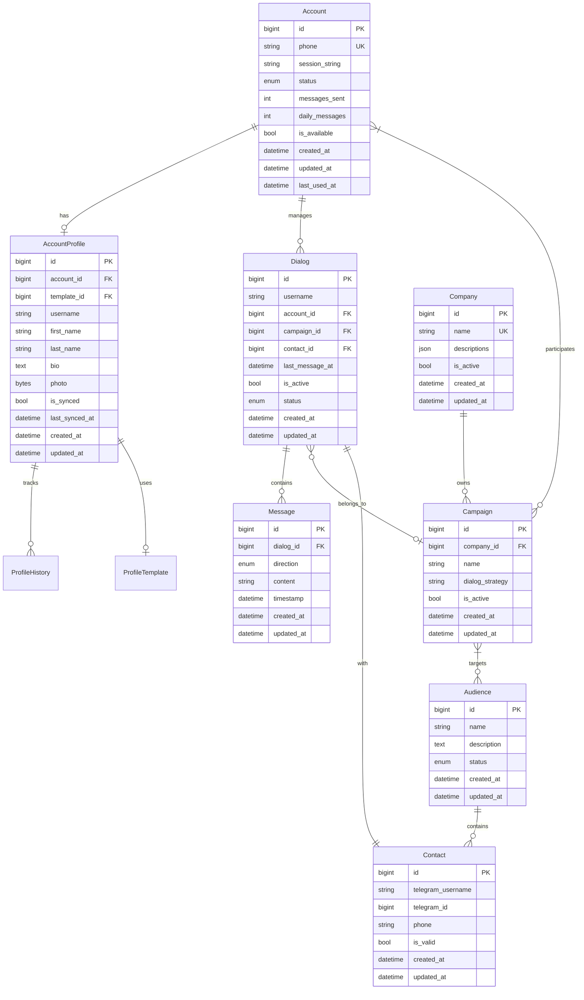

# База данных

## Архитектура

### Основные компоненты
- Аккаунты и профили (`jeeves/core/accounts/models/`)
  - `account.py` - модели аккаунтов и их состояний
  - `profile.py` - модели профилей и их истории
- Диалоги и сообщения (`jeeves/core/messaging/models/`)
  - `dialog.py` - модели диалогов и их статусы
  - `message.py` - модели сообщения и направления
- Аудитории и контакты (`jeeves/core/audiences/models/`)
  - `models.py` - модели аудиторий и контактов
- Компании и кампании (`jeeves/core/companies/models/`)
  - `company.py` - модели компаний и их настройки
  - `campaign.py` - модели рекламных кампаний

### Общая схема


## Работа с базой данных

### Активные/неактивные записи

Для полей, обозначающих активность записи, используется булево поле `is_active`:

```python
class Company(Base):
    is_active: Mapped[bool] = mapped_column(Boolean, default=True)

class Campaign(Base):
    is_active: Mapped[bool] = mapped_column(Boolean, default=True)
```

### Именование Enum значений

Все значения в Enum классах должны быть в нижнем регистре:

```python
class AccountStatus(str, Enum):
    """Account status enum."""
    new = "new"              # ✅ Правильно
    active = "active"        # ✅ Правильно
    disabled = "disabled"    # ✅ Правильно

    NEW = "new"              # ❌ Неправильно
    ACTIVE = "active"        # ❌ Неправильно
    DISABLED = "disabled"    # ❌ Неправильно
```

### Отношения между моделями

#### Избегание циклических импортов

Для избежания циклических импортов между моделями, все many-to-many отношения должны быть определены в `tables.py`:

1. Определите таблицы связей с явным указанием поведения при удалении:
```python
campaigns_accounts = Table(
    "campaigns_accounts",
    Base.metadata,
    Column(
        "campaign_id",
        Integer,
        ForeignKey("campaigns.id", ondelete="CASCADE"),
        primary_key=True
    ),
    Column(
        "account_id",
        Integer,
        ForeignKey("accounts.id", ondelete="CASCADE"),
        primary_key=True
    ),
)
```

2. Оп��еделите функцию настройки отношений с явным указанием каскадного поведения:
```python
def setup_relationships():
    """Set up relationships between models."""
    Campaign.accounts = relationship(
        "Account",
        secondary=campaigns_accounts,
        back_populates="campaigns",
        cascade="save-update",  # Только сохранение и обновление
        passive_deletes=True,   # Удаление через БД
    )
    Account.campaigns = relationship(
        "Campaign",
        secondary=campaigns_accounts,
        back_populates="accounts",
        cascade="save-update",
        passive_deletes=True,
    )
```

3. Вызовите функцию при инициализации:
```python
# В core/db/__init__.py
from .tables import setup_relationships

# Set up model relationships
setup_relationships()
```

#### Правила работы с отношениями

✅ Правильно:
```python
# Определение отношений в одном месте (tables.py)
Campaign.accounts = relationship(
    "Account",
    secondary=campaigns_accounts,
    back_populates="campaigns",
    cascade="save-update",
    passive_deletes=True,
)

# Использование SQL для удаления связей
stmt = delete(campaigns_accounts).where(
    campaigns_accounts.c.campaign_id == campaign_id,
    campaigns_accounts.c.account_id == account_id
)
await session.execute(stmt)

# Обновление списка через append/remove
campaign.accounts.append(account)
campaign.accounts.remove(account)
```

❌ Неправильно:
```python
# Дублирование определений отношений в моделях
class Account(Base):
    campaigns = relationship(...)  # Не определяйте здесь

# Прямое присваивание списка без проверки
campaign.accounts = []  # Используйте remove() или SQL DELETE

# Удаление записей вместо связей
await session.delete(account)  # Удаляет сам аккаунт
```

### Декоратор @with_queries

Декоратор для автоматического управления сессиями базы данных. Поддерживает работу с одним или несколькими классами запросов:

```python
# Один класс запросов
@with_queries(AccountQueries)
async def get_accounts(queries: AccountQueries):
    return await queries.get_all_accounts()

# Несколько классов запросов
@with_queries((DialogQueries, AccountQueries))
async def start_dialog(
    dialog_queries: DialogQueries,
    account_queries: AccountQueries
):
    account = await account_queries.get_available_account()
    return await dialog_queries.create_dialog(account.id)
```

#### Особенности работы
1. Автоматическое создание и закрытие сессии
2. Общая сессия для всех классов запросов
3. Автоматический rollback при ошибках
4. Именование параметров по типу запросов

#### Правила использования

✅ Правильно:
```python
@with_queries(AccountQueries)
async def check_account(queries: AccountQueries):
    account = await queries.get_account_by_phone(phone)
    return account.status == AccountStatus.active

@with_queries((DialogQueries, AccountQueries))
async def process_dialog(
    dialog_queries: DialogQueries,
    account_queries: AccountQueries
):
    # Все операции в одной транзакции
    account = await account_queries.get_account()
    dialog = await dialog_queries.create_dialog(account.id)
```

❌ Неправильно:
```python
# Не храните сессию как атрибут класса
class BadManager:
    def __init__(self):
        self.session = AsyncSession(engine)

# Не создавайте множественные сессии
async def bad_operation():
    async with get_db() as session1:
        # Первая операция
        pass
    async with get_db() as session2:
        # Связанная операция
        pass
```

# Database Design and Usage

This document describes the database design principles and usage patterns in the project.

## Model Relationships

### Many-to-Many Relationships

For many-to-many relationships, define association tables with proper cascade behavior and indexes:

```python
# Association table
my_association = Table(
    "my_association",
    Base.metadata,
    Column(
        "left_id",
        Integer,
        ForeignKey("left.id", ondelete="CASCADE"),
        primary_key=True,
        index=True
    ),
    Column(
        "right_id",
        Integer,
        ForeignKey("right.id", ondelete="CASCADE"),
        primary_key=True,
        index=True
    ),
)

# Left model
class Left(Base):
    rights: Mapped[List["Right"]] = relationship(
        secondary=my_association,
        back_populates="lefts",
        passive_deletes=True,  # Let DB handle cascade deletes
        lazy="selectin"  # For small collections
    )

# Right model
class Right(Base):
    lefts: Mapped[List["Left"]] = relationship(
        secondary=my_association,
        back_populates="rights",
        passive_deletes=True,
        lazy="selectin"
    )
```

### One-to-One Relationships

For one-to-one relationships, use `uselist=False` and appropriate cascade behavior:

```python
# Parent model
profile: Mapped[Optional["Profile"]] = relationship(
    "Profile",
    back_populates="parent",
    uselist=False,
    cascade="all, delete-orphan"
)

# Child model
parent_id: Mapped[int] = mapped_column(
    BigInteger,
    ForeignKey("parents.id", ondelete="CASCADE"),
    unique=True,
    index=True
)
```

### One-to-Many Relationships

For one-to-many relationships, define cascade behavior based on dependency:

```python
# Parent model with cascade delete
children: Mapped[list["Child"]] = relationship(
    "Child",
    back_populates="parent",
    cascade="all, delete-orphan"
)

# Child model with indexed foreign key
parent_id: Mapped[int] = mapped_column(
    BigInteger,
    ForeignKey("parents.id", ondelete="CASCADE"),
    index=True
)
```

### Profile Management Pattern

For models that track profile data with history:

1. Main profile table with current state
2. History table for tracking changes
3. Template table for reusable profiles

Example:
```python
class Profile(Base):
    id: Mapped[int] = mapped_column(primary_key=True)
    account_id: Mapped[int] = mapped_column(ForeignKey("accounts.id"), unique=True)
    template_id: Mapped[Optional[int]] = mapped_column(
        ForeignKey("templates.id"),
        nullable=True
    )

    # Current state fields
    is_synced: Mapped[bool] = mapped_column(default=False)
    last_synced_at: Mapped[DateTimeType]

    # History tracking
    history: Mapped[list["ProfileHistory"]] = relationship(
        cascade="all, delete-orphan"
    )

class ProfileHistory(Base):
    id: Mapped[int] = mapped_column(primary_key=True)
    profile_id: Mapped[int] = mapped_column(
        ForeignKey("profiles.id", ondelete="CASCADE"),
        index=True
    )
    change_type: Mapped[str] = mapped_column(String)
```

### Performance Optimization

1. **Indexes**
   - Add indexes on all foreign key columns
   - Add unique constraints where appropriate
   - Add composite indexes for frequently queried combinations
   - Consider partial indexes for filtered queries

2. **Lazy Loading**
   - Use `lazy="selectin"` for small, frequently accessed relationships
   - Use `lazy="select"` (default) for large or rarely accessed relationships
   - Use `lazy="dynamic"` for relationships that need custom filtering
   - Use `lazy="noload"` for relationships that are rarely needed

3. **Batch Operations**
   - Use `session.bulk_save_objects()` for multiple inserts
   - Use `session.bulk_update_mappings()` for multiple updates
   - Consider using `yield_per()` for large result sets

4. **Cascade Behavior**
   - Use `cascade="all, delete-orphan"` for dependent relationships
   - Use `cascade="save-update"` with `passive_deletes=True` for many-to-many
   - Add `ondelete="CASCADE"` to foreign keys for DB-level cascades

## Query Patterns

### Using the with_queries Decorator

All database operations should use the `with_queries` decorator to ensure proper session handling:

```python
@with_queries(AccountQueries)
async def get_account(self, account_id: int, queries: AccountQueries) -> Optional[Account]:
    return await queries.get_by_id(account_id)
```

### SQL Comments

SQL comments should be in English and describe the purpose of complex queries:

```sql
-- Get active accounts with message count in last 24 hours
SELECT a.*, COUNT(m.id) as message_count
FROM accounts a
LEFT JOIN messages m ON m.account_id = a.id
WHERE a.is_active = true
AND m.created_at >= NOW() - INTERVAL '24 hours'
GROUP BY a.id
```

## Testing

1. Use fixtures for database setup
2. Clean up test data after each test
3. Use transactions to isolate test cases
4. Mock external dependencies

## Migration Guidelines

1. Always create new migrations for schema changes
2. Include both upgrade and downgrade paths
3. Test migrations with real data samples
4. Document breaking changes
