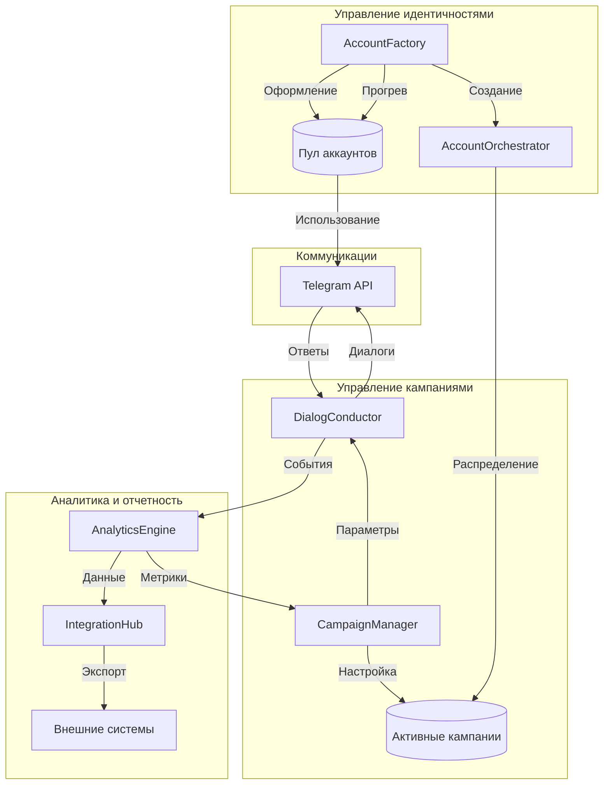

# Jeeves: Компоненты системы

## Философия архитектуры

Подобно тому, как Дживс виртуозно управляет всеми аспектами жизни своего работодателя, система Jeeves организована вокруг принципов профессионального менеджмента, безупречной коммуникации и эффективной многозадачности.

## Системный Workflow



### Основные компоненты

1. **AccountFactory**
   - Создание и подготовка профилей
   - Управление репутацией
   - Контроль качества оформления
   - Мониторинг состояния

2. **AccountOrchestrator**
   - Распределение ресурсов
   - Балансировка нагрузки
   - Контроль использования
   - Оптимизация эффективности

3. **CampaignManager**
   - Планирование кампаний
   - Настройка стратегий
   - Координация процессов
   - Контроль исполнения

4. **DialogConductor**
   - Ведение диалогов
   - Адаптация коммуникации
   - Обработка ответов
   - Управление контекстом

5. **AnalyticsEngine**
   - Анализ эффективности
   - Выявление паттернов
   - Формирование рекомендаций
   - Прогнозирование результатов

6. **IntegrationHub**
   - Связь с внешними системами
   - Экспорт данных
   - API интеграции
   - Синхронизация информации

### Основные потоки данных

1. **Поток подготовки аккаунтов**
   ```
   AccountFactory → Создание → Оформление → Прогрев → Пул аккаунтов
   ```

2. **Поток управления кампаниями**
   ```
   CampaignManager → Настройка кампании → Выбор аккаунтов → Запуск сценариев
   ```

3. **Поток исполнения**
   ```
   DialogConductor → Telegram API ←→ Целевая аудитория → Обработка ответов
   ```

4. **Поток аналитики**
   ```
   События → AnalyticsEngine → Метрики → Оптимизация → IntegrationHub
   ```

### Ключевые взаимодействия

1. **Подготовка → Управление**
   - AccountFactory готовит аккаунты
   - AccountOrchestrator распределяет по кампаниям
   - CampaignManager настраивает параметры использования

2. **Управление → Исполнение**
   - CampaignManager задает правила и сценарии
   - DialogConductor ведет диалоги
   - AccountOrchestrator контролирует нагрузку

3. **Исполнение → Аналитика**
   - DialogConductor генерирует события
   - AnalyticsEngine обрабатывает данные
   - IntegrationHub экспортирует результаты

4. **Аналитика → Оптимизация**
   - AnalyticsEngine выявляет паттерны
   - CampaignManager корректирует стратегии
   - AccountFactory оптимизирует подготовку
