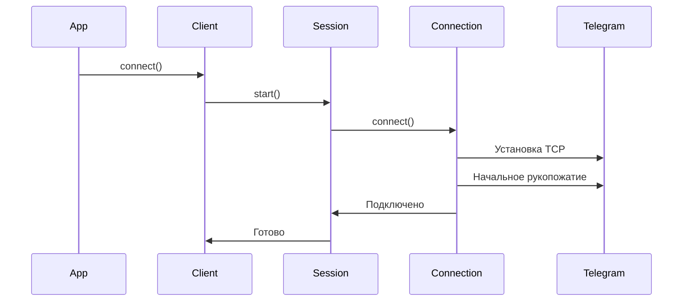
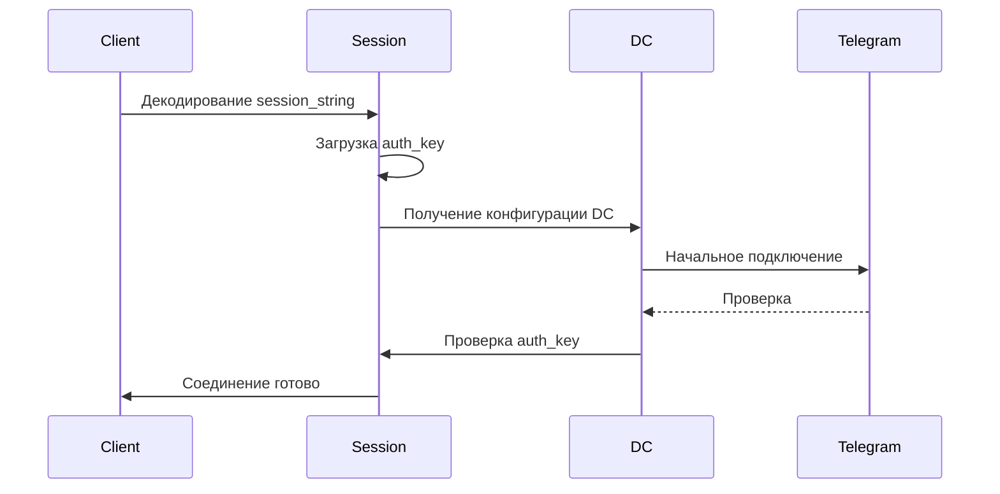
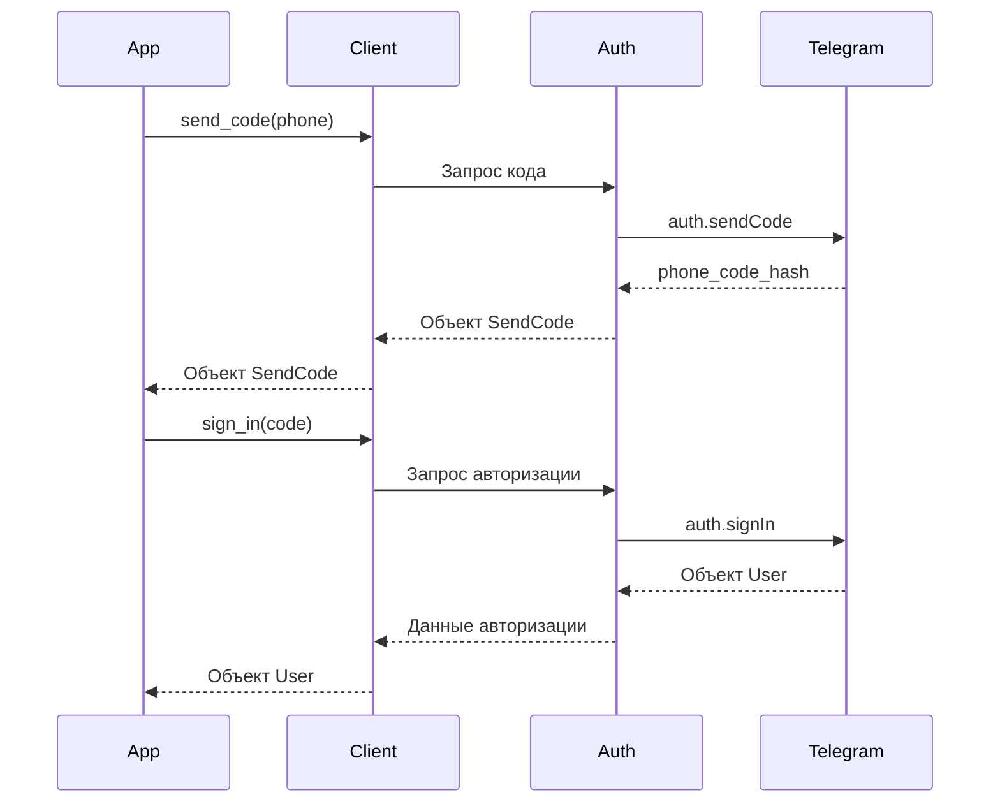

# Документация по Pyrogram API

## Оглавление
- [Обзор](#обзор)
- [Архитектура](#архитектура)
  - [Уровни абстракции](#уровни-абстракции)
  - [Процессы](#процессы)
    - [Подключение нового клиента](#подключение-нового-клиента)
    - [Подключение авторизованного клиента](#подключение-авторизованного-клиента)
    - [Авторизация](#авторизация)
- [Использование API](#использование-api)
  - [Основной класс Client](#основной-класс-client)
  - [Основные методы](#основные-методы)
  - [Обработка ошибок](#обработка-ошибок)
  - [Состояния подключения](#состояния-подключения)
- [Лучшие практики](#лучшие-практики)
  - [Работа с клиентом](#работа-с-клиентом)
  - [Обработка FloodWait](#обработка-floodwait)
  - [Управление сессиями](#управление-сессиями)
- [Ограничения](#ограничения)
  - [Лимиты API](#лимиты-api)
  - [Сессии](#сессии)
  - [Подключения](#подключения)
  - [Автоматическое восстановление](#автоматическое-восстановление)

## Обзор

Pyrogram - это современная, элегантная и асинхронная библиотека для работы с Telegram API. В нашем проекте мы используем её для управления Telegram-аккаунтами.

## Архитектура

### Уровни абстракции

1. **Уровень соединения** (`connection/connection.py`):
   - Низкоуровневое TCP-соединение
   - Шифрование MTProto
   - Обработка пакетов

2. **Уровень сессии** (`session/session.py`):
   - Управление авторизацией
   - Хранение состояния
   - Обработка обновлений

3. **Уровень аутентификации** (`session/auth.py`):
   - Реализация протокола авторизации
   - Управление ключами
   - 2FA логика

### Процессы

#### Подключение нового клиента



#### Подключение авторизованного клиента



#### Авторизация



## Использование API

### Основной класс Client

```python
from pyrogram import Client

client = Client(
    name="my_account",
    api_id=API_ID,
    api_hash=API_HASH,
    phone_number="+1234567890",
    session_string=None  # Опционально, для восстановления сессии
)
```

### Основные методы

```python
# Управление соединением
await client.connect()     # Подключение
await client.disconnect()  # Отключение
client.is_connected       # Проверка состояния

# Авторизация
sent = await client.send_code(phone_number)
# Возвращает объект SendCode:
# - phone_code_hash: str  # Хеш для sign_in
# - type: str            # Тип отправки кода
# - next_type: str      # Следующий тип отправки
# - timeout: int        # Таймаут до следующей отправки

# Вход в аккаунт
signed_in = await client.sign_in(
    phone_number=phone,
    phone_code_hash=hash,
    phone_code=code
)
# Возвращает объект User или вызывает SessionPasswordNeeded

# 2FA (если требуется)
await client.check_password(password)

# Управление сессией
session_string = await client.export_session_string()

# Отправка сообщений
await client.send_message(
    chat_id=username,  # Username или ID
    text=message
)
```

### Обработка ошибок

```python
from pyrogram.errors import (
    BadRequest,              # Общая ошибка запроса
    FloodWait,              # Превышение лимитов
    PhoneCodeExpired,       # Код подтверждения истек
    PhoneCodeInvalid,       # Неверный код
    PhoneNumberInvalid,     # Неверный номер
    SessionPasswordNeeded,   # Требуется 2FA
    AuthKeyUnregistered,    # Сессия недействительна
    PasswordHashInvalid     # Неверный пароль 2FA
)
```

### Состояния подключения

- `CONNECTING`: Процесс подключения
- `CONNECTED`: Успешно подключен
- `DISCONNECTED`: Отключен
- `FAILED`: Ошибка подключения

## Лучшие практики

### Работа с клиентом

```python
# 1. Использование контекстного менеджера
async with client:
    await client.send_message(...)

# 2. Явное управление
try:
    await client.connect()
    # работа с клиентом
finally:
    await client.disconnect()
```

### Обработка FloodWait

```python
while True:
    try:
        await client.send_message(...)
        break
    except FloodWait as e:
        await asyncio.sleep(e.value)
```

### Управление сессиями

```python
# Сохранение после авторизации
session_string = await client.export_session_string()

# Восстановление сессии
try:
    client = Client(
        "account",
        session_string=session_string,
        ...
    )
    await client.connect()
except AuthKeyUnregistered:
    # Сессия недействительна, нужна повторная авторизация
    session_string = None
```

## Ограничения

### Лимиты API
- До 30 сообщений в секунду
- До 100 запросов к API в секунду
- Особые ограничения для новых аккаунтов

### Сессии
- Одна активная сессия на клиента
- Возможна инвалидация сервером
- Рекомендуется периодическое обновление

### Подключения
- Таймаут по умолчанию: 60 секунд
- Необходима логика переподключения
- Учёт нестабильности сети

### Автоматическое восстановление
Pyrogram автоматически:
1. Переподключается при разрыве
2. Обновляет DC при необходимости
3. Поддерживает соединение активным
